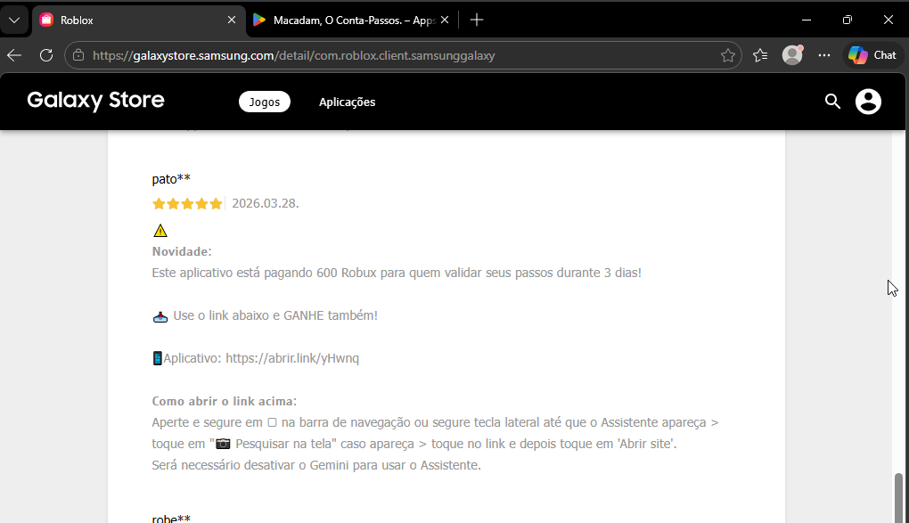
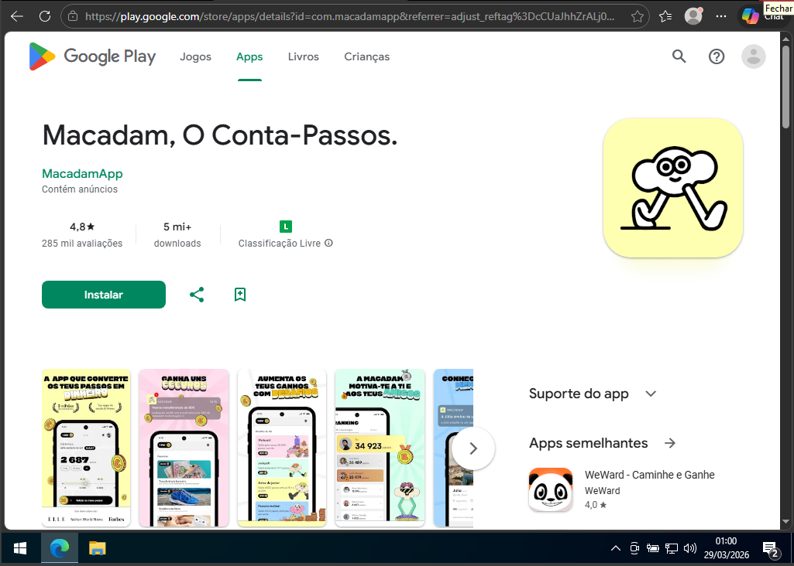
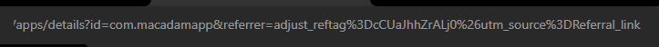

# Análise de Scam de Robux via Encurtador e CPI
Author: João  
Date: 2026

## Resumo
Este relatório analisa um golpe disseminado através de comentários em massa prometendo Robux gratuitos. O link fornecido utiliza um encurtador legítimo e redireciona usuários para um aplicativo na Google Play Store, caracterizando uma estratégia de monetização via engenharia social e instalação de aplicativos (CPI).

---

## Lure
Comentários em massa nas avaliações do aplicativo Roblox (Galaxy Store), prometendo uma quantidade de Robux grátis após a conclusão de tarefas específicas durante 3 dias.

---

## Análise do Link
**URL analisada:**
https://abrir.link/yHwnq

O domínio `abrir.link` é um encurtador legítimo, o que reduz a suspeita inicial e aumenta a probabilidade de clique por parte do usuário.

---

## Cadeia de Redirecionamento
abrir.link → Google Play Store  
(App: "Macadam, O Conta-Passos")

**Observação:**  
Não foram identificados redirecionamentos intermediários visíveis, porém não se descarta sua existência.

---

## Comportamento Observado
- Redirecionamento único para Google Play Store  
- Nenhum download automático  
- Nenhuma execução visível adicional  
- Nenhuma solicitação de permissão no navegador  

---

## Engenharia Social

**Curiosidade**  
Os comentários instigam o pensamento: *"será que funciona?"*

**Urgência / Novidade**  
"Este aplicativo está pagando X Robux para quem validar seus passos durante 3 dias! Use o link abaixo e GANHE também!"

**Ganância**  
O usuário percebe a possibilidade de obter Robux (valor digital) de forma fácil e gratuita.

**Público-alvo provável**  
Crianças e adolescentes, especialmente usuários do Roblox sem renda própria, interessados em customização de personagens e conteúdos adicionais.

---

## Objetivo do Ataque
- Monetização via instalação de aplicativo (CPI / afiliado)
- Uso de tracking (Adjust) para atribuição de instalações
- Possível uso de afiliados para distribuição do golpe
- Possível aumento artificial da base de usuários  
- Exploração de engenharia social voltada ao público jovem  

---

## Tracking e Monetização
Foi identificado o uso do parâmetro "referr" contendo "adjust_reftag", indicando utilização da plataforma Adjust para rastreamento das instalações.
Isso confirma a presença de um mecanismo de atribuição, reforçando a hipótese de monetização via CPI (Cost Per Install)

---

## IOC (Indicators of Compromise)
- https://abrir.link/yHwnq  
- Domínio: abrir.link  
- Destino: Google Play Store (com parâmetro referr)
- adjust_reftag=cfhCtHAOhvjls
- Aplicativo: "Macadam, O Conta-Passos"  
- Padrão: promessa de recompensa (Robux)

---

## Conclusão
O golpe não entrega a recompensa prometida e utiliza engenharia social para induzir usuários a instalar um aplicativo. A estratégia explora confiança em serviços legítimos e o interesse por recompensas digitais, com foco na monetização indireta pela instalação do aplicativo.
